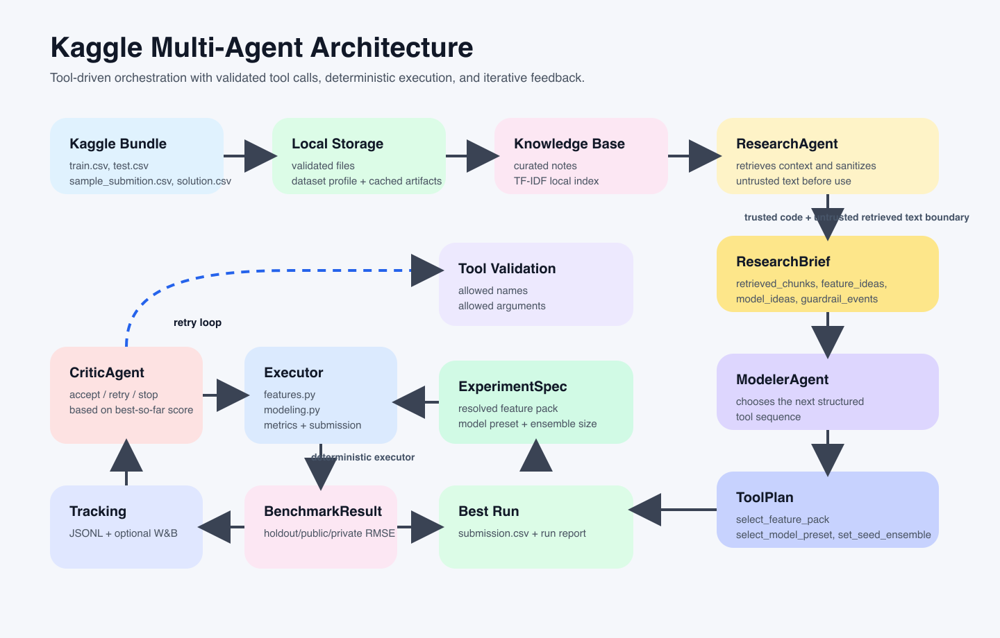

# Kaggle Multi-Agent

Tool-driven multi-agent system for `mws-ai-agents-2026`.

This repository implements a reproducible Kaggle workflow where agents do not generate arbitrary Python code at runtime. Instead, they coordinate a predefined ML pipeline through typed tool plans, retrieval, validation, and feedback loops. The executor code is deterministic; agents choose which tools to call, in what order, and which experiment configuration to assemble from those tools.

## What this project does

- loads Kaggle competition files and profiles the dataset
- builds a local knowledge base from course and competition notes
- uses a multi-agent loop to propose and evaluate experiments
- runs a tabular ML pipeline with feature packs and model configurations
- tracks holdout and offline metrics, then generates `submission.csv`

## Architecture At A Glance

1. Kaggle data is downloaded locally.
2. A local knowledge base is built from curated markdown notes.
3. `ResearchAgent` retrieves context from the knowledge base.
4. `ModelerAgent` proposes the next experiment as a typed `ToolPlan`.
5. The tool layer validates the plan and compiles it into an executable `ExperimentSpec`.
6. `CriticAgent` reads the metrics and decides whether to retry, stop, or continue.
7. The best run is stored and exported as a submission.

This is `tool-driven orchestration`, not unconstrained code generation.



Mermaid source diagrams: [docs/diagrams.md](docs/diagrams.md)

## Agents

| Agent | Responsibility | Input | Output | Implementation |
| --- | --- | --- | --- | --- |
| `ResearchAgent` | Finds relevant project context and suggests next directions | dataset profile, run history, local KB | `ResearchBrief` with retrieved chunks, feature ideas, model ideas | [src/kaggle_multi_agent/agents.py](src/kaggle_multi_agent/agents.py) |
| `ModelerAgent` | Chooses the next tool sequence | `ResearchBrief`, iteration number | `ToolPlan` with allowed tool calls and arguments | [src/kaggle_multi_agent/agents.py](src/kaggle_multi_agent/agents.py) |
| `CriticAgent` | Checks whether the current result is better and whether to continue | current metrics, best metrics, iteration budget | `CritiqueResult` with decision and actions | [src/kaggle_multi_agent/agents.py](src/kaggle_multi_agent/agents.py) |

## Tool Layer

The tool layer is the boundary between the agent system and the ML executor.

Available tools:

- `select_feature_pack(feature_pack)` chooses one of `encoded_default`, `encoded_geo`, `encoded_geo_interactions`
- `select_model_preset(preset)` chooses one of `balanced_lgbm`, `wide_lgbm`, `deep_lgbm`
- `set_seed_ensemble(size)` chooses `1` or `3`

Implementation:

- tool catalog and plan execution: [src/kaggle_multi_agent/tools.py](src/kaggle_multi_agent/tools.py)
- typed contracts for `ToolCall` and `ToolPlan`: [src/kaggle_multi_agent/contracts.py](src/kaggle_multi_agent/contracts.py)
- tool-plan validation and prompt-injection sanitization: [src/kaggle_multi_agent/guardrails.py](src/kaggle_multi_agent/guardrails.py)

## Execution Model

The executor is deterministic and lives in code, not in the LLM.

- data loading and validation: [src/kaggle_multi_agent/data.py](src/kaggle_multi_agent/data.py)
- dataset profiling: [src/kaggle_multi_agent/profiling.py](src/kaggle_multi_agent/profiling.py)
- feature engineering: [src/kaggle_multi_agent/features.py](src/kaggle_multi_agent/features.py)
- model training and evaluation: [src/kaggle_multi_agent/modeling.py](src/kaggle_multi_agent/modeling.py)
- local registry and reporting: [src/kaggle_multi_agent/registry.py](src/kaggle_multi_agent/registry.py), [src/kaggle_multi_agent/reporting.py](src/kaggle_multi_agent/reporting.py)

The main loop is implemented in [src/kaggle_multi_agent/graph.py](src/kaggle_multi_agent/graph.py). It passes typed state between the agents, the tool layer, and the executor.

## How Autonomy Works

What the system does autonomously:

- profiles the dataset
- retrieves relevant context from the local KB
- proposes the next tool sequence
- validates and executes that tool sequence
- trains and evaluates the model
- decides whether to continue through a feedback loop
- stores the best run and writes `submission.csv`

What is predefined:

- feature engineering functions in [src/kaggle_multi_agent/features.py](src/kaggle_multi_agent/features.py)
- model families and presets in [src/kaggle_multi_agent/tools.py](src/kaggle_multi_agent/tools.py)
- benchmark executor in [src/kaggle_multi_agent/modeling.py](src/kaggle_multi_agent/modeling.py)

This means the current architecture is `agentic over tools`, not `free-form codegen over arbitrary source files`.

## Model Usage

The project supports open-source models through OpenAI-compatible endpoints:

- `ollama` for local models
- `openrouter` for hosted open-source models
- `mock` for deterministic offline runs

Typical runtime split:

- `ResearchAgent` can run without an LLM because retrieval is local
- `ModelerAgent` can use an open-source instruct model to emit a structured `ToolPlan`
- `CriticAgent` can use an open-source instruct model to emit a structured `CritiqueResult`
- the tabular predictor itself is `LightGBM`, configured through tool-selected presets

The integration wrapper is in [src/kaggle_multi_agent/llm.py](src/kaggle_multi_agent/llm.py). The prompts used by the agents are also defined there and in [src/kaggle_multi_agent/agents.py](src/kaggle_multi_agent/agents.py).

## Prompt Locations

- planner prompt for tool plans: [src/kaggle_multi_agent/agents.py](src/kaggle_multi_agent/agents.py)
- critic prompt for loop decisions: [src/kaggle_multi_agent/agents.py](src/kaggle_multi_agent/agents.py)
- OpenAI-compatible client and JSON extraction: [src/kaggle_multi_agent/llm.py](src/kaggle_multi_agent/llm.py)

## Knowledge Base

The local knowledge base is built from markdown notes in:

- [knowledge_base/curated/course_notes.md](knowledge_base/curated/course_notes.md)
- [knowledge_base/curated/competition_notes.md](knowledge_base/curated/competition_notes.md)

The retrieval layer uses TF-IDF over chunked markdown passages and persists the index locally. It is intentionally local-first and auditable.

## How To Run

```bash
python3 -m venv .venv
source .venv/bin/activate
pip install -e '.[dev]'
```

Optional experiment tracking:

```bash
pip install -e '.[dev,tracking]'
export KMA_WANDB_ENABLED=true
export KMA_WANDB_PROJECT=kaggle-multi-agent
```

Put the Kaggle files into `data/`:

- `train.csv`
- `test.csv`
- `sample_submition.csv`
- `solution.csv`

Run the agent loop:

```bash
PYTHONPATH=src python -m kaggle_multi_agent.cli run-agent --data-dir data --knowledge-source-dir knowledge_base/curated --output-dir artifacts/runs --max-iterations 3
```

Run the baseline benchmark:

```bash
PYTHONPATH=src python -m kaggle_multi_agent.cli benchmark --data-dir data --output-dir artifacts/benchmark
```

Run the data profiler and local KB builder:

```bash
PYTHONPATH=src python -m kaggle_multi_agent.cli profile-data --data-dir data
PYTHONPATH=src python -m kaggle_multi_agent.cli build-kb --source-dir knowledge_base/curated
```

## Repository Layout

- `src/kaggle_multi_agent/` application code
- `tests/` unit and integration tests
- `configs/` runtime settings
- `knowledge_base/` curated retrieval content
- `docs/` architecture, security, and benchmarking docs
- `artifacts/` run outputs and submissions
- `reports/` profiling and summary outputs

## Notes For Reviewers

- The project does not rely on hidden codegen from the agents.
- The ML pipeline is explicit and reproducible.
- Agents improve the solution by choosing among typed tools and reading metrics from the executor.
- The current design is intentionally conservative so it can be audited and reproduced.
- The repository includes prompt-injection sanitization, strict tool validation, and per-iteration experiment tracking.
