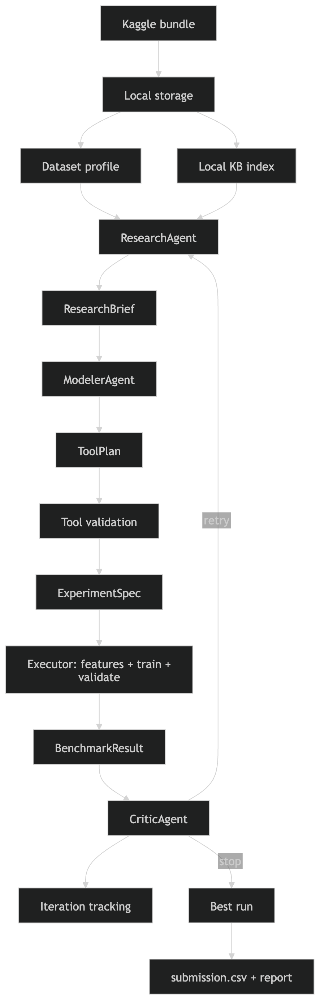
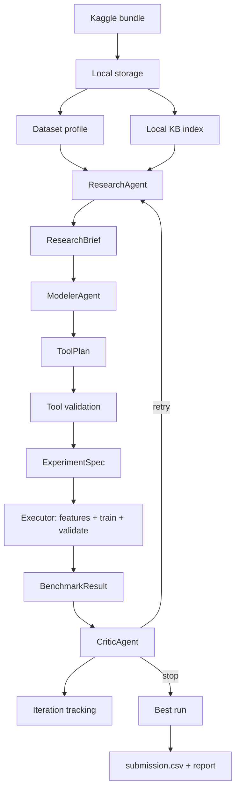
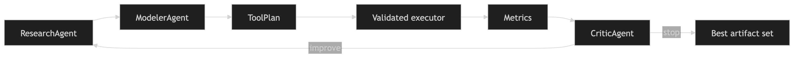
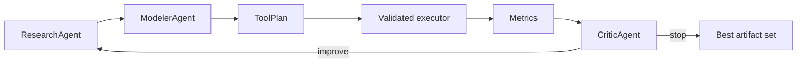
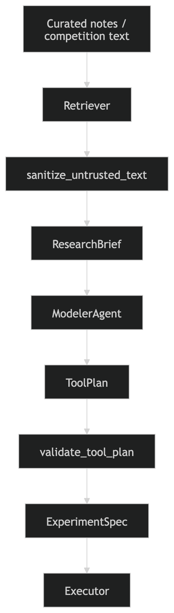
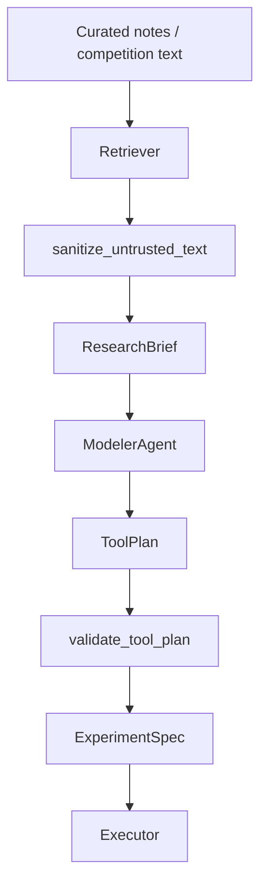

# Mermaid Diagrams

## End-to-End Architecture

Rendered image:

```mermaid
flowchart TD
    A["Kaggle bundle"] --> B["Local storage"]
    B --> C["Dataset profile"]
    B --> D["Local KB index"]
    C --> E["ResearchAgent"]
    D --> E
    E --> F["ResearchBrief"]
    F --> G["ModelerAgent"]
    G --> H["ToolPlan"]
    H --> I["Tool validation"]
    I --> J["ExperimentSpec"]
    J --> K["Executor: features + train + validate"]
    K --> L["BenchmarkResult"]
    L --> M["CriticAgent"]
    M --> N["Iteration tracking"]
    M -->|retry| E
    M -->|stop| O["Best run"]
    O --> P["submission.csv + report"]
```

## Feedback Loop

Rendered image:

```mermaid
flowchart LR
    A["ResearchAgent"] --> B["ModelerAgent"]
    B --> C["ToolPlan"]
    C --> D["Validated executor"]
    D --> E["Metrics"]
    E --> F["CriticAgent"]
    F -->|improve| A
    F -->|stop| G["Best artifact set"]
```

## Trust Boundary

Rendered image:

```mermaid
flowchart TD
    A["Curated notes / competition text"] --> B["Retriever"]
    B --> C["sanitize_untrusted_text"]
    C --> D["ResearchBrief"]
    D --> E["ModelerAgent"]
    E --> F["ToolPlan"]
    F --> G["validate_tool_plan"]
    G --> H["ExperimentSpec"]
    H --> I["Executor"]
```
